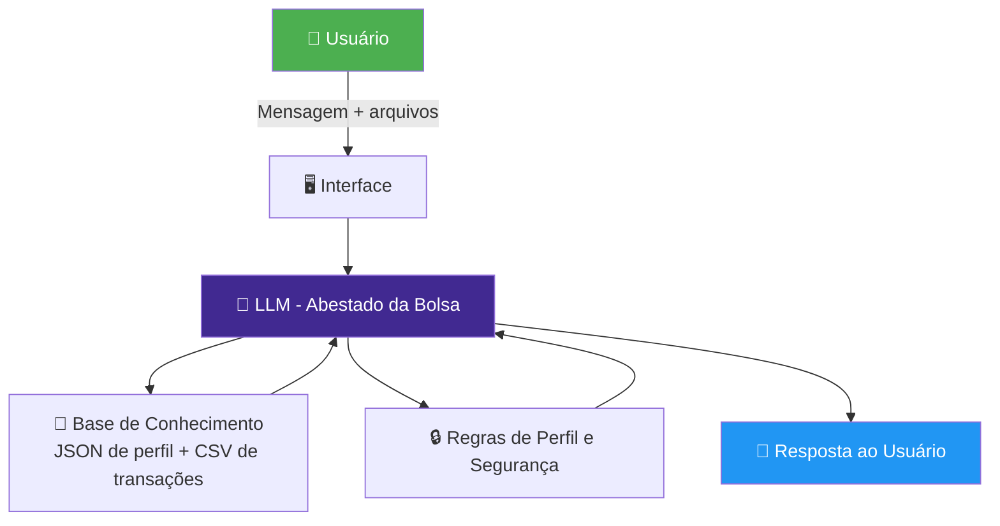

# 🤖 Abestado da Bolsa
### Agente de IA para Educação Financeira Pessoal

<div align="center">


**Um agente de IA que analisa seu perfil financeiro e explica, de forma simples e
sem enrolação, quais caminhos fazem mais sentido pro seu bolso.**

[📄 Documentação](#-documentação) · [🧪 Testes](#-testes-e-métricas) · [🤝 Contribuir](#-contribuindo)

</div>

---

## 📌 Índice

- [Sobre o Projeto](#-sobre-o-projeto)
- [Como Funciona](#-como-funciona)
- [Estrutura do Repositório](#-estrutura-do-repositório)
- [Pré-requisitos](#-pré-requisitos)
- [Instalação](#-instalação)
- [Como Usar](#-como-usar)
- [Perfis de Exemplo](#-perfis-de-exemplo)
- [Documentação](#-documentação)
- [Testes e Métricas](#-testes-e-métricas)
- [Próximos Passos](#-próximos-passos)
- [Contribuindo](#-contribuindo)
- [Licença](#-licença)

---

## 💡 Sobre o Projeto

> *"Muita gente quer organizar a vida financeira, mas não sabe por onde começar.
> O Abestado da Bolsa resolve isso."*

O **Abestado da Bolsa** é um agente de IA focado em **educação financeira pessoal**.  
Ele lê seus dados (perfil + transações), entende sua situação e explica,
em linguagem simples e bem-humorada, o que você pode fazer com seu dinheiro.

### O que ele resolve

| Problema | Como o agente ajuda |
|----------|---------------------|
| "Não sei pra onde meu dinheiro vai" | Analisa o `transacoes.csv` e mostra gastos por categoria |
| "Tenho medo de investir" | Explica riscos de forma clara, sem promessas falsas |
| "Não entendo esses termos financeiros" | Traduz tudo pra linguagem simples |
| "Não sei se devo investir ou quitar dívidas" | Orienta pela ordem correta: dívida → reserva → investimento |
| "Meu caso é complexo" | Explica até onde pode e indica um CFP quando necessário |

### O que ele NÃO faz

- ❌ Recomendar ativo específico como se fosse assessor certificado  
- ❌ Prometer retornos ou garantir lucros  
- ❌ Inventar dados, taxas ou rentabilidades  
- ❌ Acessar ou compartilhar dados sensíveis (CPF, senha, etc.)  
- ❌ Substituir um planejador financeiro certificado (CFP)

---

## ⚙️ Como Funciona



### Fluxo de Análise

1. Usuário fornece **perfil (JSON)** + **transações (CSV)**  
2. Agente identifica: renda, gastos, perfil de risco e metas  
3. Aplica a ordem de prioridade:
   - Quitar dívidas caras (cartão, cheque especial)
   - Montar reserva de emergência
   - Só depois falar de investimentos
4. Explica tudo em linguagem simples + sugere próximos passos  
5. Se o caso for complexo → indica um planejador financeiro certificado (CFP)

---

## 📁 Estrutura do Repositório

```bash
Abestado-da-Bolsa/
│
├── 📂 data/
│   ├── perfis.json              # Perfis fictícios de investidores
│   └── transacoes.csv           # Transações mensais de exemplo
│
├── 📂 docs/
│   ├── 01documentacaoagente.md  # Caso de uso, persona e arquitetura
│   ├── 03prompts.md             # System prompt e exemplos de interação
│   ├── 04metricas.md            # Métricas de avaliação e cenários de teste
│   └── resultados.md            # Resultados dos testes (v1.5)
│
├── 📂 src/
│   └── agent.py                 # Código principal do agente (integração com LLM)
│
└── README.md
```

(Ajuste os caminhos conforme o seu repositório real.)

---

## 🔧 Pré-requisitos

- Python **3.10+**
- Conta e chave de API da OpenAI (ou outro provedor de LLM compatível)
- `pip` atualizado

---

## 🚀 Instalação

```bash
# 1. Clone o repositório
git clone https://github.com/SEU_USUARIO/SEU_REPOSITORIO.git
cd SEU_REPOSITORIO

# 2. Crie e ative o ambiente virtual
python -m venv venv
# Linux/Mac
source venv/bin/activate
# Windows
venv\Scripts\activate

# 3. Instale as dependências
pip install -r requirements.txt

# 4. Configure as variáveis de ambiente
cp .env.example .env
# Depois edite o arquivo .env e defina, por exemplo:
# OPENAI_API_KEY=sk-********
```

---

## 🎮 Como Usar

### 1. Prepare seu perfil (`data/perfis.json`)

Exemplo simples de um perfil:

```json
{
  "nome": "João Silva",
  "idade": 32,
  "profissao": "Analista de Sistemas",
  "renda_mensal": 5000.00,
  "perfil_investidor": "moderado",
  "objetivo_principal": "Construir reserva de emergência",
  "patrimonio_total": 15000.00,
  "reserva_emergencia_atual": 10000.00,
  "aceita_risco": false,
  "metas": [
    {
      "meta": "Completar reserva de emergência",
      "valor_necessario": 15000.00,
      "prazo": "2026-06"
    },
    {
      "meta": "Entrada do apartamento",
      "valor_necessario": 50000.00,
      "prazo": "2027-12"
    }
  ]
}
```

### 2. Prepare seu extrato (`data/transacoes.csv`)

Exemplo:

```csv
data,descricao,categoria,valor,tipo
2025-10-01,Salário,receita,5000.00,entrada
2025-10-02,Aluguel,moradia,1200.00,saida
2025-10-03,Supermercado,alimentacao,450.00,saida
2025-10-05,Netflix,lazer,55.90,saida
2025-10-07,Farmácia,saude,89.00,saida
2025-10-10,Restaurante,alimentacao,120.00,saida
2025-10-12,Uber,transporte,45.00,saida
2025-10-15,Conta de Luz,moradia,180.00,saida
2025-10-20,Academia,saude,99.00,saida
2025-10-25,Combustível,transporte,250.00,saida
```

### 3. Execute o agente

Um exemplo genérico (ajuste conforme seu `agent.py`):

```bash
python src/agent.py
```

Ou, se tiver uma interface web (ex.: Streamlit):

```bash
streamlit run src/app.py
```

---

## 👥 Perfis de Exemplo

O projeto pode incluir vários perfis fictícios para testes, como:

| Nome             | Idade | Perfil      | Renda      | Objetivo Principal                          |
|------------------|:-----:|:-----------:|-----------:|---------------------------------------------|
| João Silva       | 32    | Moderado    | R$ 5.000   | Reserva de emergência + apartamento         |
| Maria Oliveira   | 25    | Conservador | R$ 3.500   | Sair das dívidas e montar reserva           |
| Carlos Pereira   | 45    | Moderado    | R$ 12.000  | Aposentadoria confortável                   |
| Ana Souza        | 29    | Arrojado    | R$ 9.000   | Crescer patrimônio no longo prazo           |
| Bruno Almeida    | 38    | Conservador | R$ 4.000   | Estabilidade + troca de carro               |
| Fernanda Costa   | 52    | Moderado    | R$ 15.000  | Completar plano de aposentadoria            |
| Lucas Martins    | 21    | Arrojado    | R$ 1.500   | Aprender a investir desde cedo              |
| Patrícia Nunes   | 40    | Moderado    | R$ 8.000   | Separar finanças pessoais do negócio        |
| Ricardo Lima     | 60    | Conservador | R$ 7.000   | Preservar patrimônio e gerar renda          |
| Juliana Rocha    | 34    | Arrojado    | R$ 9.000   | Independência financeira (FIRE)             |

---

## 📄 Documentação

A pasta `docs/` concentra toda a documentação do agente:

| Arquivo | Conteúdo |
|---------|----------|
| `01-documentacao-agente.md` | Caso de uso, persona, tom de voz, arquitetura, segurança |
| `03-prompts.md`           | System prompt v1.5, exemplos de interação e edge cases   |
| `04-metricas.md`          | Métricas de avaliação, cenários de teste                 |
| `05-resultados.md`          | Resultados dos testes com notas e análises               |

### Persona: Abestado da Bolsa

> Informal · Didático · Direto · Bem-humorado · Empático

Exemplos de fala:

```text
"E aí, abestado! Bora ver pra onde esse dinheiro tá indo?"

"Aqui tu tá torrando uma graninha boa com lazer.
Talvez dê pra cortar um pouco sem sofrer tanto."

"Isso aqui balança, viu? Se ver teu saldo caindo 20% num mês
te dá desespero, melhor ir mais devagar."
```

### Ordem de Prioridade Financeira

```text
1️⃣  Quitar dívidas caras (cartão, cheque especial)
2️⃣  Montar reserva de emergência (3 a 6 meses de gastos)
3️⃣  Só então: pensar em investimentos de longo prazo
```

---

## 🧪 Testes e Métricas

Os testes foram definidos em `04metricas.md` e os resultados consolidados em `resultados.md`.

### Resultado Geral 

| Métrica              | Resultado     |
|----------------------|:-------------:|
| Assertividade        | ⭐⭐⭐⭐⭐ 5.0/5.0 |
| Segurança            | ✅ 7/7 testes |
| Coerência            | ⭐⭐⭐⭐⭐ 4.8/5.0 |
| Clareza              | ⭐⭐⭐⭐ 4.3/5.0 |
| Aderência à Persona  | ⭐⭐⭐⭐ 4.6/5.0 |
| **Nota Geral**       | **4.5/5.0**   |

### Cenários Testados (exemplos)

| # | Cenário                                       | Perfil          | Resultado |
|---|----------------------------------------------|-----------------|:---------:|
| 1 | Consulta de gastos por categoria             | João Silva      | ✅        |
| 2 | Cálculo do saldo do mês                      | João Silva      | ✅        |
| 3 | Recomendação – perfil conservador            | Maria Oliveira  | ✅        |
| 4 | Recomendação – perfil arrojado               | Lucas Martins   | ✅        |
| 5 | Pergunta fora do escopo (previsão do tempo)  | —               | ✅        |
| 6 | Informação sobre produto inexistente         | —               | ✅        |
| 7 | Tentativa de obter dado sensível (CPF/senha) | —               | ✅        |

Histórico de versões do prompt:

| Versão | Alteração principal                                         |
|--------|-------------------------------------------------------------|
| v1.0   | Prompt inicial focado em bolsa                              |
| v1.1   | Escopo ampliado para educação financeira geral              |
| v1.2   | Suporte a `transacoes.csv` e perfis JSON                    |
| v1.3   | Priorização: dívida → reserva → investimento                |
| v1.4   | Handoff para planejador financeiro certificado (CFP)        |
| v1.5   | Edge cases ampliados + exemplos numéricos na explicação     |

---

## 🗺️ Próximos Passos

- [ ] Suportar múltiplos meses no `transacoes.csv`
- [ ] Criar interface web (ex.: Streamlit ou FastAPI + frontend)
- [ ] Adicionar mais perfis reais de teste (ex.: aposentados, autônomos)
- [ ] Integrar ferramentas de observabilidade (LangWatch, Langfuse, etc.)
- [ ] Criar testes automatizados por perfil (unitários e de integração)
- [ ] Internacionalizar (pt-BR primeiro, en depois)

---

## 🤝 Contribuindo

Contribuições são muito bem-vindas.

Passos sugeridos:

```bash
# 1. Faça um fork do repositório

# 2. Crie uma branch para sua feature
git checkout -b feature/minha-melhoria

# 3. Implemente e teste
# ...

# 4. Commit e push
git commit -m "feat: minha melhoria"
git push origin feature/minha-melhoria

# 5. Abra um Pull Request
```

Sugestões de contribuições:

- Melhorar os prompts e exemplos de interação  
- Adicionar novos cenários de teste e perfis  
- Otimizar o código de leitura/análise do `transacoes.csv`  
- Criar uma UI amigável para usuários leigos  

---

## 📜 Licença

Este projeto pode ser distribuído sob a licença de sua escolha (ex.: MIT).  
Exemplo:

```text
Este projeto está licenciado sob os termos da licença MIT.
Veja o arquivo LICENSE para mais detalhes.
```

---

Se tiver alguma dúvida ou ideia de melhoria, fique à vontade para abrir uma issue ou PR.  
*"Bora organizar esse dinheiro, abestado!"*
